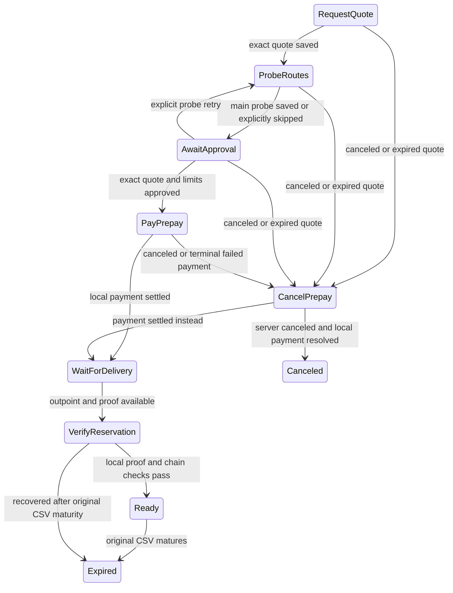

# Client asset reservation purchase

The client uses named actions and `OnRecover`, as in static-address Loop In.
Tests use the real SQLite store with node doubles, not real asset transfers.

Every state accepts `OnRecover`. `AwaitApproval` waits for explicit consent.
The transition to `PayPrepay` saves the prepay routing cap and `SkipProbe` in
the same transaction; that state records consent. If the write fails, recovery
waits for approval again. If it succeeds, recovery resumes payment with those
saved choices. Before sending, save the exact payment hash, paying node,
and LND request. Look up that payment first on every recovery. A timeout or a
different paying node must never be reported as payment-not-found. A terminal
failed payment is canceled, not paid again. Settlement resumes delivery even
after quote expiry or a lost cancellation reply.

Entry writes precede actions. If a write fails, make no further node call and
reload the durable record before the next event. No observer notification can
substitute for a committed state. Normal approval requires a successful main
probe. Before approval, `SkipProbe` preserves the preference to skip automatic
probing across restarts. Approval must explicitly set it again to permit payment
without a successful probe. An explicit probe retry clears it. Quote validation
and payment limits remain mandatory.

Server status is only a delivery hint. Verify the full exported proof with
tapd and the shared deposit kit, then check exact output, local keys, amount,
three required confirmations, known spends, and the original CSV clock.
Spend and expiry tracking follow Instant Out's LND notifications. Recovery
restores the watches; it does not require wallet history or a synchronous
unspent assertion.
A late client does not impose a new initial-delivery window: the server checks
that promise when first delivering. Client `Ready` means verified and unexpired;
a later swap must still enforce the saved execution cutoff and claim margin.

Genuine inconsistencies enter `NeedAdminAttention` and notify the operator.
Temporary node errors keep their state for retry. Real node adapters and
runtime registration remain separate steps; no RPC or CLI is enabled here.
