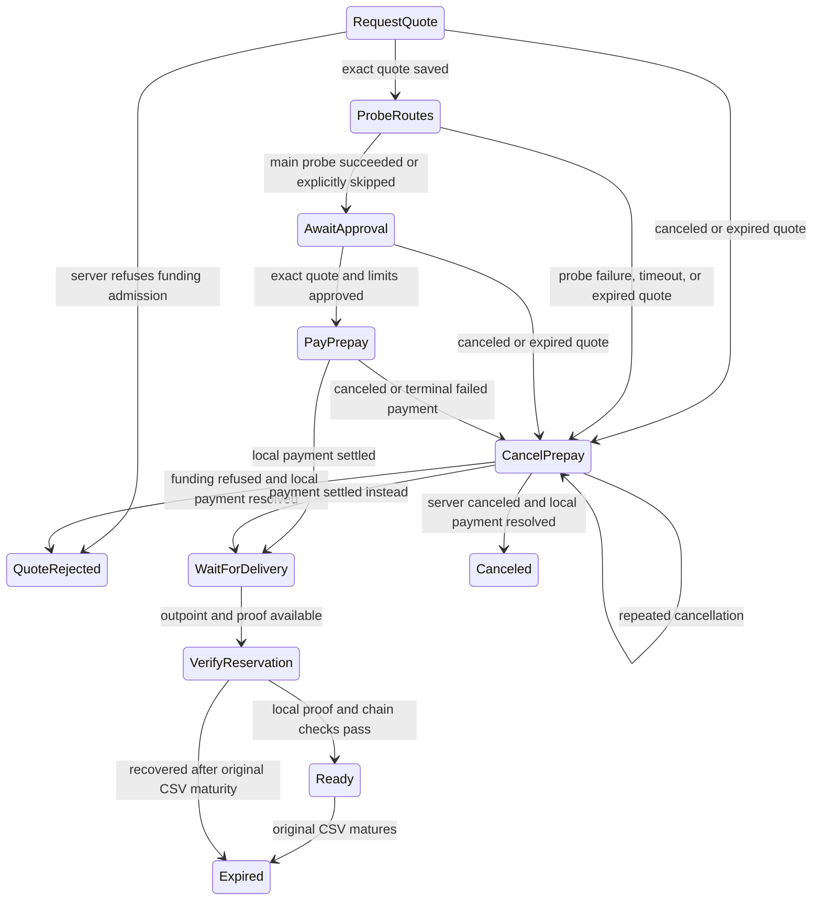

# Client asset reservation purchase

The client uses named actions and `OnRecover`, as in static-address Loop In.
Tests use the real SQLite store with node doubles, not real asset transfers.

An `OutOfRange` quote refusal ends in `QuoteRejected` before any probe or
payment. This terminal state is saved, excluded from active lists and restart
recovery, and cannot resume when inventory returns. The CLI reports
`cannot initiate swap: rpc error: code = OutOfRange desc = amount above current maximum`.
A new attempt requires a fresh purchase ID. Transient quote RPC errors retry.
The same terminal state and CLI error represent a later funding refusal: the
server must confirm cancellation with `funding_unavailable`, and the client
must first resolve its own payment. An in-flight held prepay stays tracked and
is never resent or treated as canceled solely because of server status.
New servers hold the prepay while preparing funding and settle after Bitcoin
publication. The client requires local settlement before delivery verification.

Every state accepts `OnRecover`. `AwaitApproval` waits for explicit consent.
The transition to `PayPrepay` saves the prepay routing cap and `SkipProbe` in
the same transaction; that state records consent. If the write fails, recovery
waits for approval again. If it succeeds, recovery resumes payment with those
saved choices. Before sending, save the exact payment hash, paying node,
and LND request. Look up that payment first on every recovery. A timeout or a
different paying node must never be reported as payment-not-found. A terminal
failed payment is canceled, not paid again. Settlement resumes delivery even
after quote expiry or a lost cancellation reply.

Entry writes precede actions. If a write fails, make no further node call and
reload the durable record before the next event. No observer notification can
substitute for a committed state. Normal approval requires a successful main
probe. Before approval, `SkipProbe` preserves the preference to skip automatic
probing across restarts. Approval must explicitly set it again to permit payment
without a successful probe. Recovery tracks the single saved probe payment
and cancellation. A failed probe cancels the unpaid purchase. A new attempt
uses a fresh purchase ID; recovery never replaces or revives the old quote.
Quote validation and payment limits remain mandatory.

Server status is only a delivery hint. Verify the full exported proof with
tapd and the shared deposit kit, then check exact output, local keys, amount,
three required confirmations, unspent status, and the original CSV clock.
A late client does not impose a new initial-delivery window: the server checks
that promise when first delivering. Client `Ready` means verified and unexpired;
a later swap must still enforce the saved execution cutoff and claim margin.

Genuine inconsistencies enter `NeedAdminAttention` and notify the operator.
Temporary node errors keep their state for retry, except probe errors, which
start unpaid cancellation. Real node adapters and
runtime registration remain separate steps; no RPC or CLI is enabled here.

ProbeRoutes persists its node, request, and deadline before `SendPaymentV2`.
It validates the server receipt/cancellation report and the local payment-level
`FAILURE_REASON_INCORRECT_PAYMENT_DETAILS` before saving success. Live
`SendPaymentV2` and recovery `TrackPaymentV2` updates supply the route fee,
which is saved before failed attempts can be pruned. Missing route history
leaves the estimate unavailable and does not invalidate successful delivery. Failure or timeout enters `CancelPrepay`, which
requests cancellation before waiting for the local probe payment to resolve.
Explicit skip releases just the probe invoice before approval. Successful
probes also release their hold invoice; they never settle.
Recovery checks completed probe evidence before applying the probe deadline,
but an expired purchase quote still cancels. Check the deadline after status
lookups and immediately before dispatch so slow RPCs cannot start a late probe.
