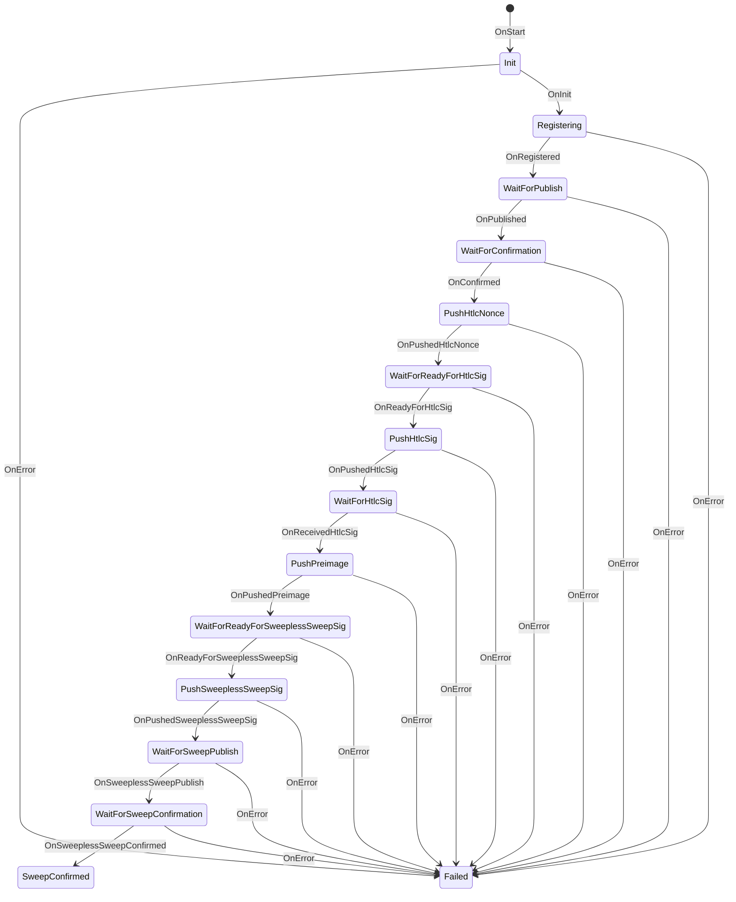

```mermaid
stateDiagram-v2
[*] --> Init: OnStart
Failed
Init
Init --> Failed: OnError
Init --> Registering: OnInit
PushHtlcNonce
PushHtlcNonce --> WaitForReadyForHtlcSig: OnPushedHtlcNonce
PushHtlcNonce --> Failed: OnError
PushHtlcSig
PushHtlcSig --> WaitForHtlcSig: OnPushedHtlcSig
PushHtlcSig --> Failed: OnError
PushPreimage
PushPreimage --> WaitForReadyForSweeplessSweepSig: OnPushedPreimage
PushPreimage --> Failed: OnError
PushSweeplessSweepSig
PushSweeplessSweepSig --> WaitForSweepPublish: OnPushedSweeplessSweepSig
PushSweeplessSweepSig --> Failed: OnError
Registering
Registering --> WaitForPublish: OnRegistered
Registering --> Failed: OnError
SweepConfirmed
WaitForConfirmation
WaitForConfirmation --> PushHtlcNonce: OnConfirmed
WaitForConfirmation --> Failed: OnError
WaitForHtlcSig
WaitForHtlcSig --> PushPreimage: OnReceivedHtlcSig
WaitForHtlcSig --> Failed: OnError
WaitForPublish
WaitForPublish --> WaitForConfirmation: OnPublished
WaitForPublish --> Failed: OnError
WaitForReadyForHtlcSig
WaitForReadyForHtlcSig --> PushHtlcSig: OnReadyForHtlcSig
WaitForReadyForHtlcSig --> Failed: OnError
WaitForReadyForSweeplessSweepSig
WaitForReadyForSweeplessSweepSig --> PushSweeplessSweepSig: OnReadyForSweeplessSweepSig
WaitForReadyForSweeplessSweepSig --> Failed: OnError
WaitForSweepConfirmation
WaitForSweepConfirmation --> SweepConfirmed: OnSweeplessSweepConfirmed
WaitForSweepConfirmation --> Failed: OnError
WaitForSweepPublish
WaitForSweepPublish --> WaitForSweepConfirmation: OnSweeplessSweepPublish
WaitForSweepPublish --> Failed: OnError
```