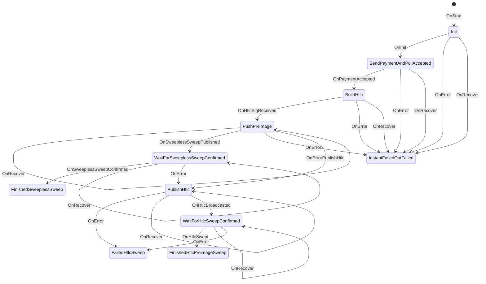

```mermaid
stateDiagram-v2
[*] --> Init: OnStart
BuildHtlc
BuildHtlc --> PushPreimage: OnHtlcSigReceived
BuildHtlc --> InstantFailedOutFailed: OnError
BuildHtlc --> InstantFailedOutFailed: OnRecover
FailedHtlcSweep
FinishedSweeplessSweep
Init
Init --> SendPaymentAndPollAccepted: OnInit
Init --> InstantFailedOutFailed: OnError
Init --> InstantFailedOutFailed: OnRecover
InstantFailedOutFailed
PublishHtlc
PublishHtlc --> FailedHtlcSweep: OnError
PublishHtlc --> PublishHtlc: OnRecover
PublishHtlc --> WaitForHtlcSweepConfirmed: OnHtlcBroadcasted
PushPreimage
PushPreimage --> PushPreimage: OnRecover
PushPreimage --> WaitForSweeplessSweepConfirmed: OnSweeplessSweepPublished
PushPreimage --> InstantFailedOutFailed: OnError
PushPreimage --> PublishHtlc: OnErrorPublishHtlc
SendPaymentAndPollAccepted
SendPaymentAndPollAccepted --> BuildHtlc: OnPaymentAccepted
SendPaymentAndPollAccepted --> InstantFailedOutFailed: OnError
SendPaymentAndPollAccepted --> InstantFailedOutFailed: OnRecover
WaitForHtlcSweepConfirmed
WaitForHtlcSweepConfirmed --> FinishedHtlcPreimageSweep: OnHtlcSwept
WaitForHtlcSweepConfirmed --> WaitForHtlcSweepConfirmed: OnRecover
WaitForHtlcSweepConfirmed --> FailedHtlcSweep: OnError
WaitForSweeplessSweepConfirmed
WaitForSweeplessSweepConfirmed --> FinishedSweeplessSweep: OnSweeplessSweepConfirmed
WaitForSweeplessSweepConfirmed --> WaitForSweeplessSweepConfirmed: OnRecover
WaitForSweeplessSweepConfirmed --> PublishHtlc: OnError
```