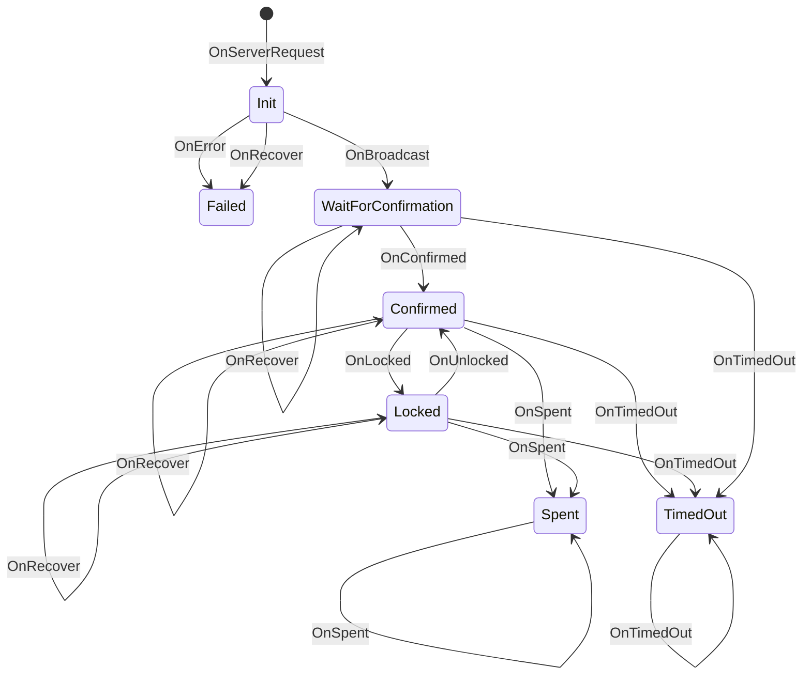

```mermaid
stateDiagram-v2
[*] --> Init: OnServerRequest
Confirmed
Confirmed --> Confirmed: OnError
Confirmed --> Locked: OnLocked
Confirmed --> Confirmed: OnRecover
Confirmed --> Spent: OnSpent
Confirmed --> TimedOut: OnTimedOut
Failed
Init
Init --> WaitForConfirmation: OnBroadcast
Init --> Failed: OnError
Init --> Failed: OnRecover
Locked
Locked --> Locked: OnError
Locked --> Locked: OnRecover
Locked --> Spent: OnSpent
Locked --> TimedOut: OnTimedOut
Locked --> Confirmed: OnUnlocked
Spent
Spent --> Spent: OnSpent
TimedOut
TimedOut --> TimedOut: OnTimedOut
WaitForConfirmation
WaitForConfirmation --> Confirmed: OnConfirmed
WaitForConfirmation --> WaitForConfirmation: OnRecover
WaitForConfirmation --> TimedOut: OnTimedOut
```