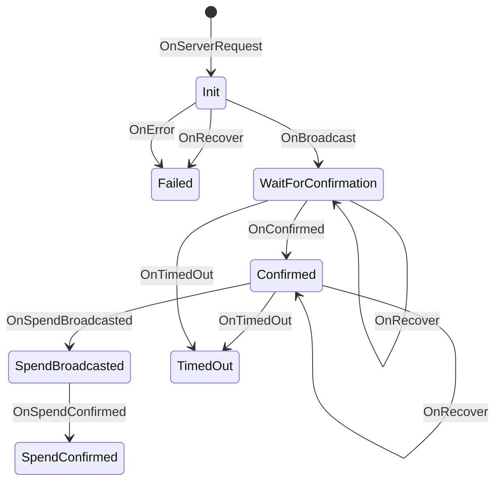

```mermaid
stateDiagram-v2
[*] --> Init: OnServerRequest
Confirmed
Confirmed --> SpendBroadcasted: OnSpendBroadcasted
Confirmed --> TimedOut: OnTimedOut
Confirmed --> Confirmed: OnRecover
Failed
Init
Init --> WaitForConfirmation: OnBroadcast
Init --> Failed: OnRecover
Init --> Failed: OnError
SpendBroadcasted
SpendBroadcasted --> SpendConfirmed: OnSpendConfirmed
SpendConfirmed
TimedOut
WaitForConfirmation
WaitForConfirmation --> WaitForConfirmation: OnRecover
WaitForConfirmation --> Confirmed: OnConfirmed
WaitForConfirmation --> TimedOut: OnTimedOut
```