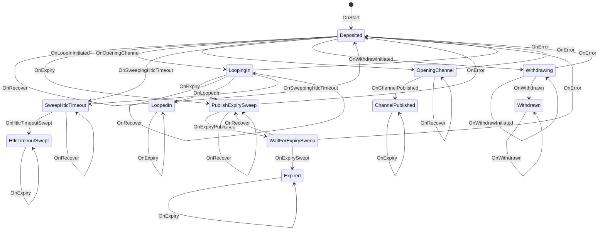

```mermaid
stateDiagram-v2
[*] --> Deposited: OnStart
ChannelPublished
ChannelPublished --> ChannelPublished: OnExpiry
Deposited
Deposited --> Deposited: OnError
Deposited --> PublishExpirySweep: OnExpiry
Deposited --> LoopingIn: OnLoopInInitiated
Deposited --> OpeningChannel: OnOpeningChannel
Deposited --> Deposited: OnRecover
Deposited --> SweepHtlcTimeout: OnSweepingHtlcTimeout
Deposited --> Withdrawing: OnWithdrawInitiated
Expired
Expired --> Expired: OnExpiry
HtlcTimeoutSwept
HtlcTimeoutSwept --> HtlcTimeoutSwept: OnExpiry
LoopedIn
LoopedIn --> LoopedIn: OnExpiry
LoopingIn
LoopingIn --> Deposited: OnError
LoopingIn --> PublishExpirySweep: OnExpiry
LoopingIn --> LoopingIn: OnLoopInInitiated
LoopingIn --> LoopedIn: OnLoopedIn
LoopingIn --> LoopingIn: OnRecover
LoopingIn --> SweepHtlcTimeout: OnSweepingHtlcTimeout
OpeningChannel
OpeningChannel --> ChannelPublished: OnChannelPublished
OpeningChannel --> Deposited: OnError
OpeningChannel --> OpeningChannel: OnExpiry
OpeningChannel --> OpeningChannel: OnRecover
PublishExpirySweep
PublishExpirySweep --> Deposited: OnError
PublishExpirySweep --> WaitForExpirySweep: OnExpiryPublished
PublishExpirySweep --> PublishExpirySweep: OnRecover
SweepHtlcTimeout
SweepHtlcTimeout --> HtlcTimeoutSwept: OnHtlcTimeoutSwept
SweepHtlcTimeout --> SweepHtlcTimeout: OnRecover
WaitForExpirySweep
WaitForExpirySweep --> Deposited: OnError
WaitForExpirySweep --> Expired: OnExpirySwept
WaitForExpirySweep --> PublishExpirySweep: OnRecover
Withdrawing
Withdrawing --> Deposited: OnError
Withdrawing --> Withdrawing: OnExpiry
Withdrawing --> Withdrawing: OnRecover
Withdrawing --> Withdrawing: OnWithdrawInitiated
Withdrawing --> Withdrawn: OnWithdrawn
Withdrawn
Withdrawn --> Withdrawn: OnExpiry
Withdrawn --> Withdrawn: OnWithdrawn
```