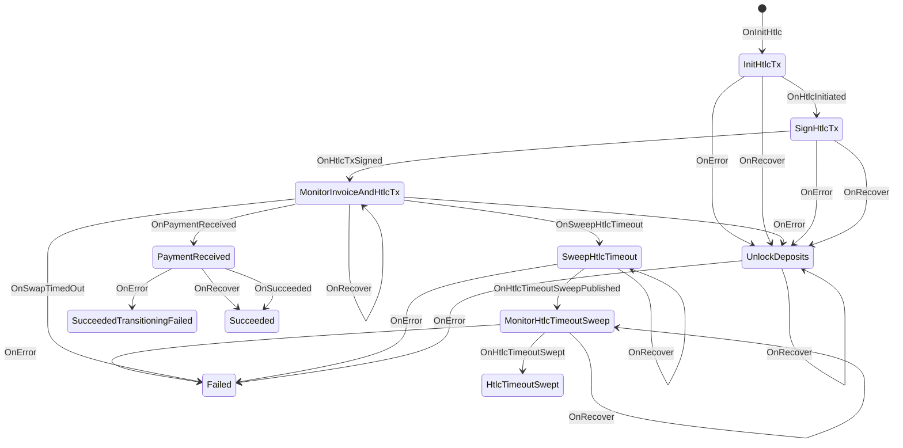

```mermaid
stateDiagram-v2
[*] --> InitHtlcTx: OnInitHtlc
Failed
HtlcTimeoutSwept
InitHtlcTx
InitHtlcTx --> UnlockDeposits: OnError
InitHtlcTx --> SignHtlcTx: OnHtlcInitiated
InitHtlcTx --> UnlockDeposits: OnRecover
MonitorHtlcTimeoutSweep
MonitorHtlcTimeoutSweep --> Failed: OnError
MonitorHtlcTimeoutSweep --> HtlcTimeoutSwept: OnHtlcTimeoutSwept
MonitorHtlcTimeoutSweep --> MonitorHtlcTimeoutSweep: OnRecover
MonitorInvoiceAndHtlcTx
MonitorInvoiceAndHtlcTx --> UnlockDeposits: OnError
MonitorInvoiceAndHtlcTx --> PaymentReceived: OnPaymentReceived
MonitorInvoiceAndHtlcTx --> MonitorInvoiceAndHtlcTx: OnRecover
MonitorInvoiceAndHtlcTx --> Failed: OnSwapTimedOut
MonitorInvoiceAndHtlcTx --> SweepHtlcTimeout: OnSweepHtlcTimeout
PaymentReceived
PaymentReceived --> SucceededTransitioningFailed: OnError
PaymentReceived --> Succeeded: OnRecover
PaymentReceived --> Succeeded: OnSucceeded
SignHtlcTx
SignHtlcTx --> UnlockDeposits: OnError
SignHtlcTx --> MonitorInvoiceAndHtlcTx: OnHtlcTxSigned
SignHtlcTx --> UnlockDeposits: OnRecover
Succeeded
SucceededTransitioningFailed
SweepHtlcTimeout
SweepHtlcTimeout --> Failed: OnError
SweepHtlcTimeout --> MonitorHtlcTimeoutSweep: OnHtlcTimeoutSweepPublished
SweepHtlcTimeout --> SweepHtlcTimeout: OnRecover
UnlockDeposits
UnlockDeposits --> Failed: OnError
UnlockDeposits --> UnlockDeposits: OnRecover
```